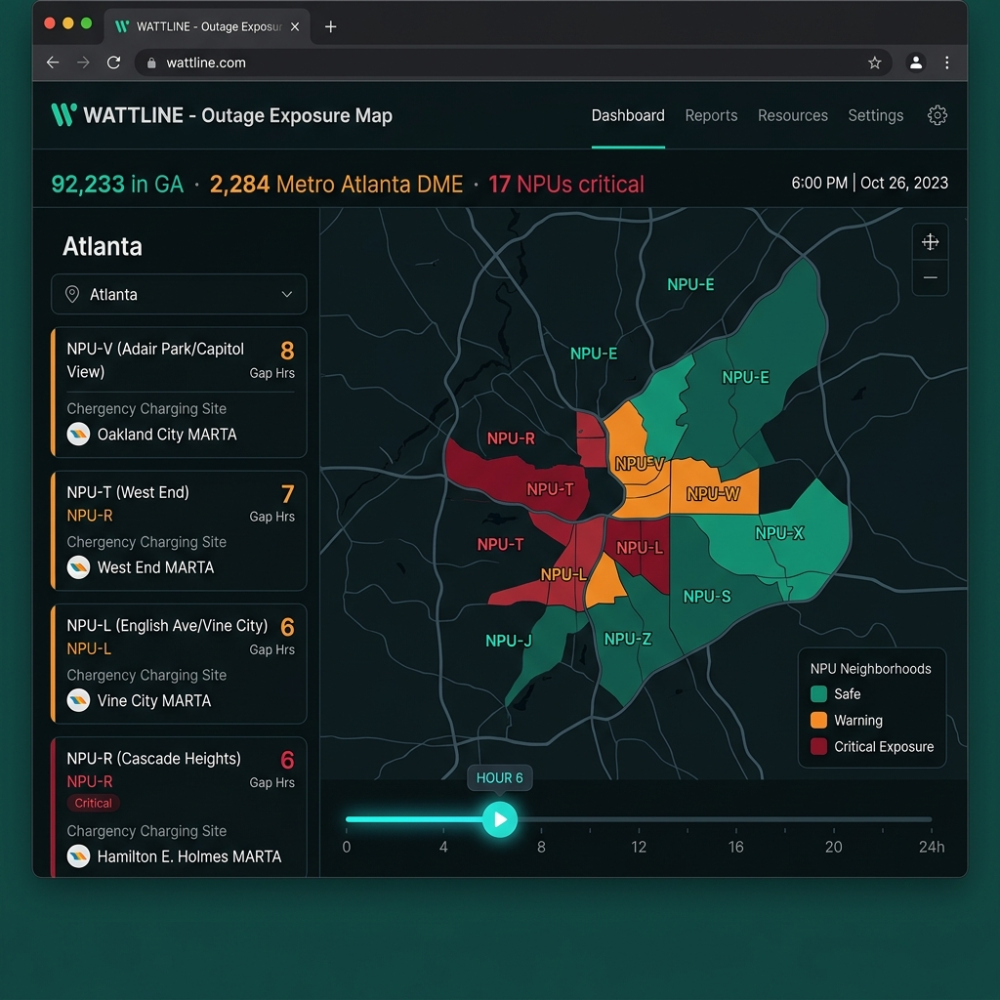

<!-- ═══════════════════════════════════════════════════════════════════
  SUBMISSION TODOs — fill these at T+3:45, then delete this comment block:
  1. Live demo URL  (Guttu, after Render deploy)
  2. Video URL      (Kareem, must be PUBLIC — unlisted does not count)
  3. Screenshot     (drop docs/demo.png, uncomment the image line below)
  4. If Tiger Data ends up hosting the time-series, add it to Architecture
═══════════════════════════════════════════════════════════════════ -->

# WATTLINE

**When the power goes out, some people are on a clock. Nobody is counting.**

[Live demo](#) · [2-minute video](#) · Built at Hack RenderATL, August 2026



## The problem

A portable oxygen concentrator runs under an hour on battery. Georgia Power
tells customers to prepare for three days without electricity, and their entire
published guidance for medical equipment is one line: "Keep your phones and
medical devices charged."

After Hurricane Helene, parts of Augusta were dark for nine days. Richmond
County has 1,647 people on electricity-dependent medical equipment. Statewide:
92,233.

We read Georgia Power's $912M storm cost recovery case (GA PSC Docket 44280) —
all data-request responses, the May 2026 stipulation, and the Commission's
order. The words *medical*, *ventilator*, *oxygen*, and *vulnerable* appear
zero times.

## What WATTLINE does

**1. Identify.** Federal emPOWER data publishes at ZIP level — a ZIP can span a
senior tower and a golf course. We disaggregate onto Atlanta parcels and NPU
boundaries, weighted by housing units and tract-level age and disability rates.
Conserves exactly against the 92,233 state total.

**2. Exposure gap.** Not a prediction — a subtraction. Utility restoration ETA
minus the manufacturer's published minimum runtime for the devices counted in
that area.

**3. Reach.** Charging capacity at libraries, fire stations, and rec centers,
assigned to the highest-gap neighborhoods — constrained by MARTA transit
reachability, because a household with no vehicle cannot reach a site no bus
serves.

## What it does not do

It does not touch utility restoration order. Georgia Power restores hospitals,
then the highest-customer-count repairs — that is correct. A crew on a feeder
restores 3,000 customers; the same crew on a lateral restores one house.
WATTLINE uses a different resource pool: buildings, not crews.

## API

Four read-only endpoints, everything precomputed — nothing calculates per
request. Shapes are frozen; `mocks/` is the contract source of truth until
real data lands.

| Endpoint | Returns |
|---|---|
| `GET /api/npus` | NPU polygons + disaggregated population (GeoJSON) |
| `GET /api/exposure?hour=N` | Per-NPU exposure gap and tier at outage hour N (0–24) |
| `GET /api/sites` | Charging sites with transit reachability and assignments |
| `GET /api/stats` | Header numbers |

## Data sources

| Source | Use |
|---|---|
| [HHS emPOWER](https://empowerprogram.hhs.gov/) | De-identified counts of electricity-dependent Medicare beneficiaries |
| [Atlanta Regional Commission Open Data](https://opendata.atlantaregional.com/) | Parcels, building footprints |
| [City of Atlanta DPCD](https://dpcd-coaplangis.opendata.arcgis.com/) | NPU boundaries, public facilities |
| [MARTA GTFS](https://www.itsmarta.com/app-developer-resources.aspx) | Transit reachability |
| [Census ACS](https://www.census.gov/data/developers/data-sets/acs-5year.html) | B01001 (age), B18101 (disability), B08201 (vehicle access) |
| GA PSC Docket 44280 | Storm restoration record |

## Architecture

Python ingest → Postgres + PostGIS → FastAPI → React + MapLibre GL
Deployed on Render.

```
wattline/
├── mocks/      frozen API contract — npus, exposure, sites, stats
├── data/       device runtime floors (manufacturer published minimums)
├── scripts/    make_mocks.py — regenerates mocks/ deterministically
├── pipeline/   ingest + disaggregation + exposure series   (build-day)
├── api/        FastAPI, read-only                          (build-day)
└── web/        React + Vite + MapLibre GL                  (build-day)
```

## Running locally

```bash
# Mock data (works today — the frontend builds against this)
python scripts/make_mocks.py     # regenerates mocks/*.json

# Full stack (as the pipeline lands)
cp .env.example .env             # add DATABASE_URL
pip install -r requirements.txt
python -m pipeline.ingest
uvicorn api.main:app --reload
cd web && npm install && npm run dev
```

## Limitations

- **emPOWER is Medicare-only.** It excludes private insurance, Medicaid-only,
  military coverage, and long-term care residents, and undercounts under-65
  disabled people. 92,233 is a floor, not a ceiling.
- **Lookback windows** are 13 months for most DME, 36 months for oxygen
  concentrators, 5 years for implanted cardiac devices. This is "filed a claim,"
  not "currently uses."
- **HHS suppresses small cells** — values 1–10 are published as 11. We treat
  these as intervals and test containment, not equality.
- **ZIP codes do not nest inside counties.** Only 109 of Georgia's 159 counties
  reconcile, so we conserve against the state total.
- Output is a **scenario-based neighborhood priority surface**, not a claim
  about where specific individuals live.
- Battery runtimes are manufacturer published minimums. An assistive technology
  specialist at Georgia Tech CIDI confirmed to us that no one in the field will
  commit to hard runtime numbers — charge state, battery age, and defects all
  vary, and every factor makes it worse. Our gap is the optimistic case.

## Acknowledgments

Georgia Council on Developmental Disabilities and Tools for Life / Center for
Inclusive Design & Innovation at Georgia Tech both responded to our questions
during the build.

## Team

Vinh Le · Niko · Guttu · Kareem

## License

MIT
